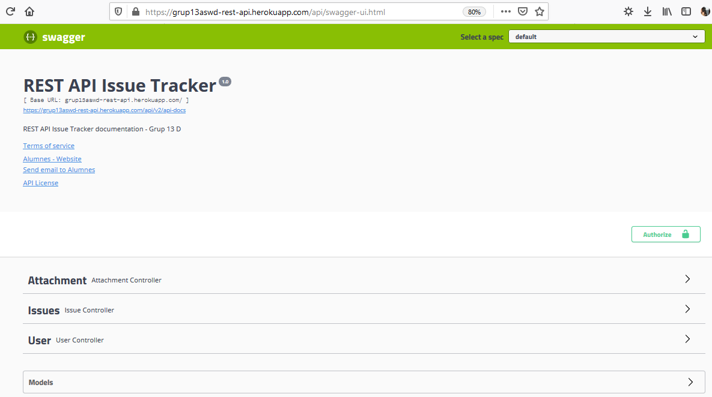
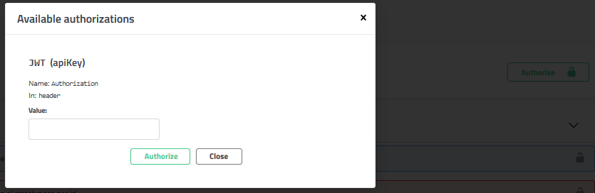
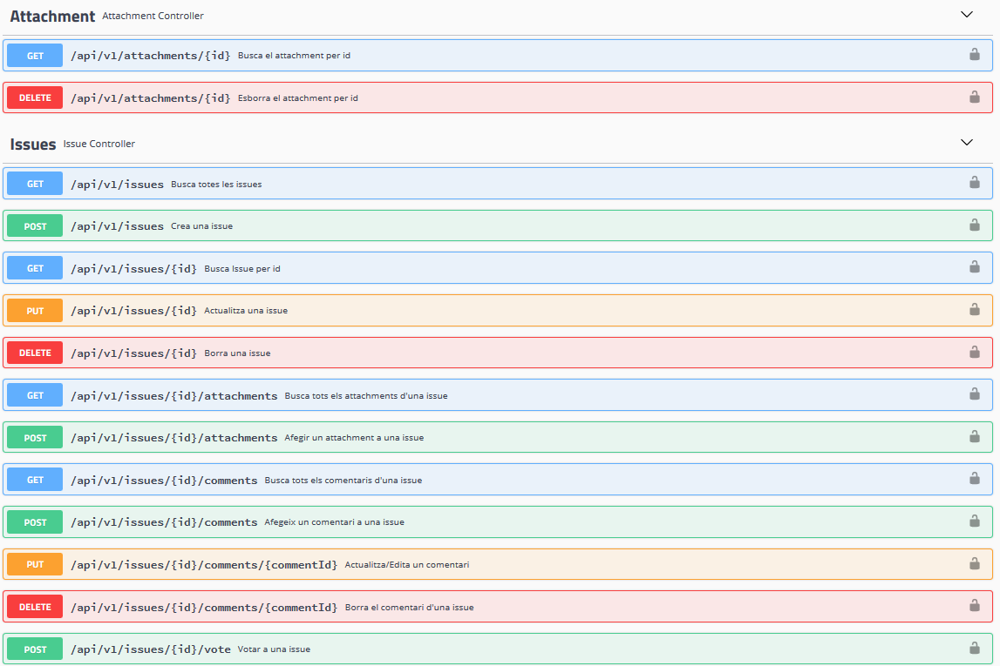
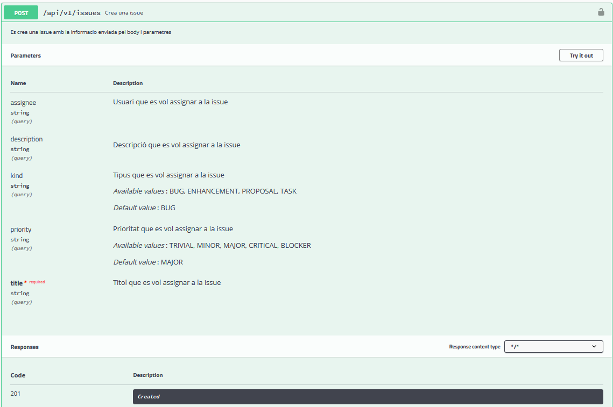
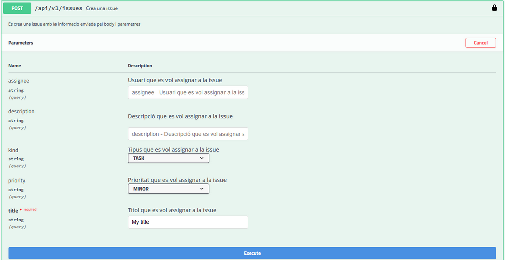
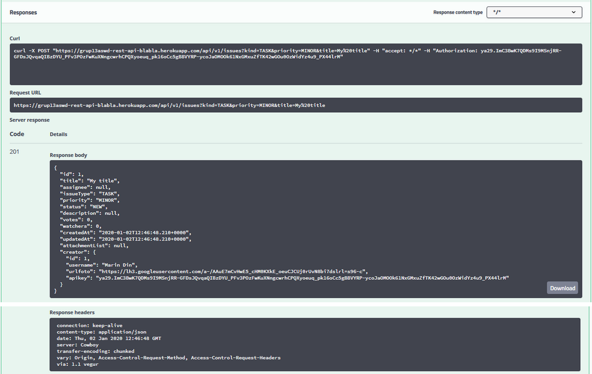

# REST API IssueTracker 

A REST API based on level 2 from the Richardson Maturity Model. 
Made it with [Spring Boot](https://spring.io/projects/spring-boot) and the [Swagger UI](https://swagger.io/tools/swagger-ui/).

# Screenshots
These are some screenshots of our Swagger UI.

## Home Page

## Authorize
We have used some kind of api-key to raise the security of our API.

## Methods
These are all of API methods, clasified by three kinds.

.png)

## Method Detail
This is an example of a POST method. This one creates an issue.

.png)

This is the entry.

And this would be the response.

# Authors
- Danci, Marian Dumitru
- Ait Fonollà, Adem
- Segura Sánchez, Enric
- Conesa Gago, Agustí

Link to heroku:
https://grup13aswd-rest-api-blabla.herokuapp.com/api/swagger-ui.html
